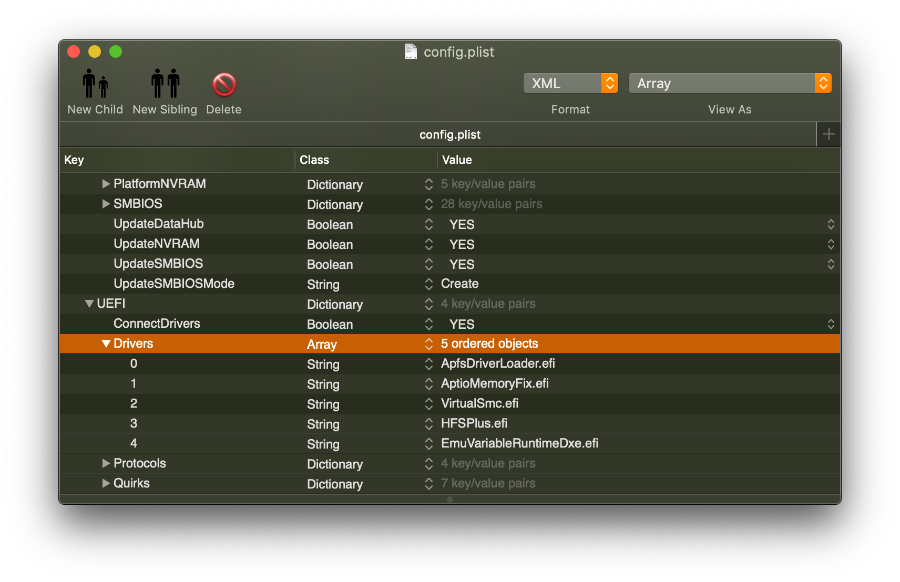

# Wiki
[wiki](https://github.com/cattyhouse/oc-guide/wiki) 会放一些OpenCore使用过程中的一些经验

# 关于本文
- 尽可能用最简单的语言描述OpenCore安装和启动黑苹果.
- 不提供最终的启动文件,而是提供方法.有了正确的方法, 就可以完全掌控自己的电脑.
- 黑苹果用到的所有工具,kexts以及efi文件的链接都指向原作者,可以及时的了解原作者的更新内容, 同时确保你看到这篇文章的时候, 使用的是最新.
- 建议通读本文并理解后,再开始你自己黑苹果之旅.

# 黑苹果与白苹果的主要区别
> 2006年乔布斯将苹果电脑使用的处理器从IBM转向Intel之后, 在普通PC上安装macOS的大门才算正式开启, 随着硬件的发展, PC与苹果电脑的差异越来越小, 黑苹果越来越接近苹果电脑, 目前的区别主要在于EFI以及ACPI.
- EFI
    - Bootloader所在的分区, [OpenCore](https://github.com/acidanthera/OpenCorePkg), Clover等都安装在这里. 苹果电脑则是采用私有的booloader
    - 分区格式为FAT32, 所以Windows, Linux, macOS等等都可以读写这个分区的文件
    - OpenCore可以放在SSD的EFI分区里, 也可以放在FAT32格式的USB盘上, 建议调试阶段使用USB盘,调试完毕复制到SSD的EFI分区

- ACPI
    - ACPI是保存在BIOS里面的描述硬件的一张表
    - PC与苹果电脑的ACPI内容大致一样,但也有不少的区别,这些少量区别足以导致一个原生的macOS安装盘在PC上启动失败.
    - OpenCore作为一个booloader,除了负责启动macOS之外的另一个主要功能就是修改PC的ACPI表兼容macOS

> 所以接下来的内容就非常明了:
- 制作一个macOS启动U盘, 直接采用苹果官方提供的方法.
- 生成一个OpenCore的EFI放在U盘, 将macOS安装到PC并启动
- 复制U盘上的EFI到安装好macOS的SSD上, 从SSD启动macOS, 脱离U盘.

# OpenCore的优缺点

## 优点
- 结构非常简单,没有安装文件pkg,跟搭积木一样简单,就算没有任何黑苹果经验, 也很容易上手
- 体积非常小, 只有9k的`BOOTx64.efi`启动文件和~200KB的`OpenCore.efi`主文件
- 速度非常快
- 文档非常完善,每一个配置都有详尽的说明
- 全新的Bootloader, 没有历史包袱
- 稳定, 非常稳定
- 安全, 可以选择对自身做签名,防止篡改
- 配置文件有严格的一一对应的要求, 所以你知道自己在干什么.

## 缺点
- 目前处于开发阶段, 更新会比较勤, 变动可能会比较大, 不过作者会做详细的变动记录,文档都及时更新
- Clover的某些功能在OpenCore上面缺失, 不过目前的功能完全够用

# 制作macOS启动U盘
> 以下方法来自苹果官网
- [格式化U盘](https://support.apple.com/zh-cn/HT208496)
    - 至少8GB容量, 使用macOS的磁盘工具格式化
    - 选择`GUID分区表`以及`Mac OS 扩展格式`
    - 启动盘U盘一定要使用`Mac OS 扩展格式`, 否则后面的步骤无法操作
- [创建启动盘](https://support.apple.com/zh-cn/HT201372)

# 挂载U盘的EFI分区
> 挂载EFI分区,供安装OpenCore使用
- macOS下的方法, 打开终端.app, 执行以下命令
    - 确定EFI所在的位置
        ```sh
        diskutil list | grep -A4 external
        ```
    - 输出结果举例, EFI在 `disk4s1`
        ````
          1:   EFI EFI   209.7 MB   disk4s1
        ````
    - 挂载EFI分区, 完成后桌面会出现一个名为EFI空分区, 所有的Opencore的操作都在这个EFI分区的EFI文件夹下面进行
        ```sh
        sudo diskutil mount /dev/disk4s1
        ```
- Windows下的方法
    
    - 由于我已经很久没有用Windows了, 各位可以Google一下, 应该有无数种软件可以做到.
- Linux下的方法
    
    - 这对于Linux用户来说小case, 不做阐述

# 最简单的安装macOS的方法

> 此为无需制作启动盘的安装方法

> 此方法源自OpenCore的文档, 需要先配置好OpenCore, 然后用它来启动Recovery的DMG.有兴趣的可以继续看
[OpenCore从Recovery的DMG安装macOS各种版本](oc-dmg-install.md)

# OpenCore安装与配置

## OpenCore的文件结构
> 首先, 我们看看一个已经配置好的OpenCore v0.03 的文件结构, 在EFI分区 (/Volumes/EFI/)下面, 有一个EFI文件夹, 内容如下

````
EFI
│   ├── BOOT
│   │   └── BOOTx64.efi
│   └── OC
│       ├── ACPI
│       │   ├── SSDT-PLUG.aml
│       ├── Drivers
│       │   ├── ApfsDriverLoader.efi
│       │   ├── AptioMemoryFix.efi
│       │   ├── EmuVariableRuntimeDxe.efi
│       │   ├── HFSPlus.efi
│       ├── Kexts
│       │   ├── AppleALC.kext
│       │   ├── IntelMausiEthernet.kext
│       │   ├── Lilu.kext
│       │   ├── SMCProcessor.kext
│       │   ├── SMCSuperIO.kext
│       │   ├── VirtualSMC.kext
│       │   └── WhateverGreen.kext
│       ├── OpenCore.efi
│       ├── Tools
│       │   ├── CleanNvram.efi
│       │   └── Shell.efi
│       └── config.plist

````

> 简单说明如下

- `EFI/BOOT/BOOTx64.efi` 电脑启动的时候读取的引导文件, 前面说过, 只有9KB
- `EFI/OC` OpenCore存放目录
    - `ACPI` 存放自定义的ssdt aml文件, 比如
        - [`SSDT-PLUG.aml`](EFI/ACPI/SSDT-PLUG.aml) 开启硬件变频功能, 作用于CPU, iGPU, dGPU.
    - `Drivers` 存放文件系统驱动文件, 比如
        - [`ApfsDriverLoader.efi`](https://github.com/acidanthera/AppleSupportPkg/releases) 用于加载macOS内置的apfs.efi,读取APFS分区
        - [`AptioMemoryFix.efi`](https://github.com/acidanthera/AptioFixPkg/releases) fix BIOS firmware, 让macOS可以正确启动
        - [`EmuVariableRuntimeDxe.efi`](EFI/OC/Drivers/EmuVariableRuntimeDxe.efi) 大部分100/200/300系列的主板的nvram无法被macOS访问, 这个efi提供一个模拟的nvram, Justin从[UDK 2018](https://github.com/tianocore/edk2/tree/UDK2018)的源代码编译
        - [`HFSPlus.efi`](EFI/OC/Drivers/HFSPlus.efi) 提供HFS+文件系统的支持, 目前macOS的安装U盘以及Recovery分区需要此efi
    - `Kexts` 存放各种设备和硬件的驱动或者补丁.
        - [`Lilu.kext`](https://github.com/acidanthera/Lilu/releases) 一个框架式的kext,自身单独使用没有作用, 是其他kext的依赖, 必须第一个被加载.
        - [`AppleALC.kext`](https://github.com/acidanthera/AppleALC/releases) 让macOS可以正确识别主板上的RealTek集成声卡
        - [`VirtualSMC.kext`](https://github.com/acidanthera/VirtualSMC/releases) 模拟SMC, 不可或缺
        - [`WhateverGreen.kext`](https://github.com/acidanthera/WhateverGreen/releases) 解决iGPU, AMD/nVidia GPU的各种问题,
        - 其他的几个kext, 根据需要使用, 比如[`IntelMausiEthernet.kext`](EFI/OC/Kexts/IntelMausiEthernet.kext.zip)(Justin根据[Mieze的源代码](https://github.com/Mieze/IntelMausiEthernet)编译)驱动板载intel网卡, [`SMCProcessor.kext SMCSuperIO.kext`](https://github.com/acidanthera/VirtualSMC/releases) 让macOS下的监控软件可以读取主板上的传感器信息温度,频率等
    - `Tools` 工具类efi,这些工具在OpenCore启动界面可以看到, 目前只有下面2个工具, **不可以放入Drivers文件夹**
        - [`CleanNvram.efi`](https://github.com/acidanthera/AptioFixPkg/releases) 清空nvram, 等效于启动到macOS恢复模式之后, 运行 `nvram -c`
        - [`Shell.efi`](https://github.com/acidanthera/OpenCoreShell/releases) 一个修改版的 `UEFI SHELL`, 可以做很多有趣的事情.
    - `OpenCore.efi` OpenCore的主引导文件, 体积约200KB
    - `config.plist` OpenCore的主要配置文件, 可以使用PlistEdit Pro 或者 Xcode 可视化编辑.

> 所以, OC下面总共有4个文件夹, 2个主文件, 是不是非常简洁

## 编译 OpenCore
- 编译并不是必须的, 作者有提供0.02的版本下载, 不过我目前用的是 0.03 版本, 需要编译
- 编译非常简单, 不要怕, 作者什么都写好了
- 编译不需要安装体积巨大的Xcode, 代码如下
    ```sh
    git clone https://github.com/acidanthera/OpenCorePkg 
    cd OpenCorePkg
    ./macbuild.tool
    cp Binaries/RELEASE/OpenCore-*-RELEASE.zip ~/Desktop
    ```
- 我已经提供[编译好的0.03版本](OpenCore-v0.0.3-RELEASE.zip)

## 搭积木 - 从零开始组建OpenCore
> 相信看完 `OpenCore的文件结构`, 心里已经有底了, 我们从0开始玩, 以下终端操作, 当然也可以在Finder里面鼠标操作, 结果是一样.

- 用前面挂载EFI的方法, 我们进入macOS启动U盘的EFI分区
    ```sh
    cd /Volumes/EFI/
    ```
- 然后建立一个叫做EFI的文件夹
    ```sh
    mkdir EFI && cd EFI
    ```
- 然后建立 OpenCore 的文件结构
    ```sh
    mkdir BOOT
    mkdir -p OC/{ACPI,Drivers,Kexts,Tools}
    ```
- 结构建立好了, 接下来将OpenCore-v0.0.3-RELEASE.zip解压,取出需要的文件放入对应的地方:
    - BOOTx64.efi 放入 BOOT 文件夹
    - OpenCore.efi 放入 OC 文件夹
    - Docs 里面的 SampleFull.plist 命名为 config.plist, 放入 OC 文件夹
    - 将 `OpenCore的文件结构` 中提到的 *.aml, *.kext, *.efi 按自己的需求需复制到对应的 `ACPI , Drivers , Kexts , Tools` 文件夹.
- 积木搭建完毕

## 配置config.plist

> config.plist 请使用PlistEdit Pro 或者 Xcode 进行可视化编辑

> 关于配置, 作者有非常详细的[英文文档](OpenCore-v0.0.3-RELEASE.zip), 解压后在`Docs/Configuration.pdf` 如果你有兴趣,可以从头到尾看一遍, 然后在`SampleFull.plist`的基础上做修改, 我已经配置了一个非常基本的[config.plist](EFI/OC/config.plist),你可以以我的这个为基础继续配置, 会大大提高成功概率和节约时间, 由于篇幅有限,我不打算每一个项目都过一遍, 只列出注意事项:

1. EFI下面的每一个 kext, efi, aml, 都必须在config.plist里面有对应的条目, 且设置为`Enabled=YES`, 否则他们不会加载
    - `OC/ACPI/*.aml` 对应 `config.plist/ACPI/Add`
    - `OC/Drivers/*.efi` 对应 `config.plist/UEFI/Drivers`
    - `OC/Kexts/*.kext` 对应 `config.plist/Kernel/Add`
    - `OC/Tools/*.efi` 对应 `config.plist/Misc/Tools`
    - 附图举例, `config.plist/UEFI/Drivers/` 下面配置了5个条目, 要保证 `OC/Drivers/` 下面有这5个efi, 否则启动会提示出错. 同样 `OC/Drivers/` 下面如果有efi没有加入config.plist里面,是不会被加载的. 所以我上面提到的这4个一一对应的地方, 要反复核对, 确保没有疏忽. 

1. 如果config.plist里面有条目, 但是OC文件夹下面的子文件夹没有对应的文件, 启动会报错, 所以两者必须是一一对应.条目被设置为`Enabled=NO`,除外.
1. 如果你想新增一个条目, 那么可以右键点击已有条目,选择 Duplicate, 然后做相应的修改
1. 新增kext的注意事项
    - 以附图为例
    - 注意kext里面是否有可执行文件, 如果有, 需要按图填入 `ExecutablePath` 如果没有,这个地方留空.
    - 查看kext的内容, 可以右键点击kext, 然后选择`show package contents`
1. 如果你是从Clover过来的, 使用了比如`rename EHC1 to EH01`, 这样的补丁, 可以将他们添加到config.plist/ACPI/Patch, 并设置Enabled=YES 让其生效. 注意Count=0 表示搜索整个DSDT表,直到搜不到为止, Skip=0 表示从头搜到尾. TableSignature=44534454 表示搜索DSDT表(因为DSDT的hex为44534454), TableSignature=0 表示搜索整个ACPI表, 包括SSDT表.
1. config.plist里面有很多Quirks, 可以理解为作者预设好的补丁, 减轻使用者的负担, 每个Quirks的作用, 可以查阅`Docs/Configuration.pdf`
1. DeviceProperties/Add 里面的参数, 可以设置比如iGPU的`AAPL,ig-platform-id`等等
1. Kernel/Patch 是用来给macOS的内置kext打补丁的, 比如可以用来去掉USB限制, [每个版本的代码不一样, 详见这里](https://hackintosher.com/forums/thread/list-of-hackintosh-usb-port-limit-patches-10-14-updated.467/) , 当然Enabled=YES才会生效
    
    - 作者预设了一个 XhciPortLimit 的 Quirks 补丁, 可以试试看, 或许能替代上面的方法, 我给的config.plist已经把这个设置为YES, 方便首次安装的朋友, 如果你使用了Patch的方法, 那么设置此项目为NO
1. 我的 config.plist 已经设置 AppleCpuPmCfgLock=YES, AppleXcpmCfgLock=YES, 这是解决CFG LOCK问题的临时办法, 如果你的主板可以在BIOS里面关闭 CFG LOCK 或者你知道如何用Grub来关闭CFG LOCK, 可以设置这两个项目为NO.
1. 启动参数在`NVRAM/Add/7C436110-AB2A-4BBB-A880-FE41995C9F82/boot-args` 这里加入或者修改. 
1. 最后, 这个config.plist是没有序列号等等信息的, 只需要填 PlatformInfo/Generic 里面的5个项目, **不用理会** `DataHub, PlatformNVRAM, SMBIOS`, 可以使用[macserial](https://github.com/acidanthera/macserial/releases)生成或者用它查看你现有的.
    - 如果你是Clover转换过来的, 运行
        ```sh
        macserial
        ```
        将获取的信息对号入住填入.

    - 如果是全新安装OpenCore,那么 
        - 先确认你要使用的机型 (SystemProductName), 比如iMac19,2, 比如iMacPro1,1, 然后运行
            ```sh
            macserial -m iMac19,2 -g
            ```
            会生成 SystemSerialNumber | MLB, 比如
            ````
            C02ZHGY6JWDW | C02940310GUKGQG1F
            ````
        - SystemUUID 可以直接用 macOS自带的 `/usr/bin/uuidgen` 生成
        - ROM 其实就是一个MAC Address, 可以如下命令随机生成
            ```sh
            echo $FQDN|md5sum|sed 's/^\(..\)\(..\)\(..\)\(..\)\(..\).*$/02:\1:\2:\3:\4:\5/' 
            ```
            比如 `02:68:b3:29:da:98` 然后手动去掉冒号转换大写
            ````
            0268B329DA98
            ````
1.  `所有OpenCore使用的 *.efi 文件请不要从Clover拿过来用, 他们并不是很兼容, OpenCore所需的这些文件文中都给出了原作者链接. kexts文件也给出了最新的原作者链接.`

